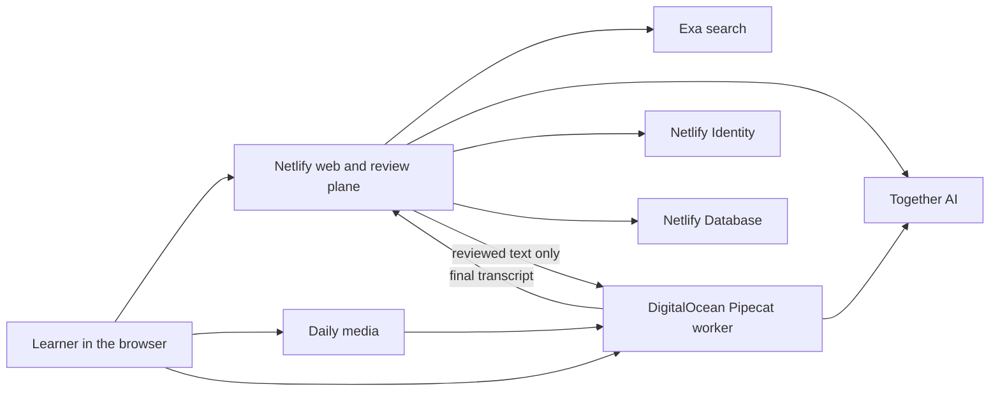

<p align="center">
  <a href="https://tutor.dharmicdata.org">
    
  </a>
</p>

<h1 align="center">Dharmic Data Tutor</h1>

<p align="center">
  Learn from named web sources, practice what you learned, get focused feedback, and return to a clear next step.
</p>

<p align="center">
  <a href="https://tutor.dharmicdata.org">Try the live tutor</a>
  ·
  <a href="https://github.com/ChaiWithJai/llamatutor/issues">View the issue board</a>
  ·
  <a href="./docs/deployment.md">Read the deployment guide</a>
</p>

<p align="center">
  <a href="https://github.com/ChaiWithJai/llamatutor/actions/workflows/ci.yml">
    
  </a>
</p>

## What this project does

Dharmic Data Tutor turns a question into a short learning session.

1. The learner enters a topic and chooses a learning level.
2. Exa finds current web sources for the topic.
3. Together AI explains the topic and names the sources that informed the answer.
4. The learner completes a short practice rep in their own words.
5. The tutor gives focused feedback and saves the next rep.
6. A signed in learner can return later and continue from the same point.

The product does not claim that a streak means mastery. A streak records that the learner practiced.

<p align="center">
  <a href="https://tutor.dharmicdata.org">
    
  </a>
</p>

## Why it exists

Most AI tutor demos answer one question and forget the learner. This project keeps the useful part of that experience and adds a small coaching loop. The learner has one active goal, one pending practice rep, saved feedback, and one clear action to take next.

The first release stays deliberately small. It does not include grading, social features, reminders, or a complex curriculum. We will add more only when learner behavior shows that the basic return loop is useful.

## Main features

- The tutor explains topics at six learning levels.
- Every lesson includes named web sources that the learner can inspect.
- Answers and coaching feedback stream into the page as they are generated.
- Signed in learners can save one active goal and one pending practice rep.
- The account page lets learners download or delete their saved learning data.
- Source failures are visible and include a retry action.
- The interface supports long sessions and narrow mobile screens.
- Rate limits protect the paid search and language model endpoints.
- GitHub Actions tests every pull request and every commit on `main`.

## How the system works



The browser never supplies a learner ID to a database query. The coaching function reads the authenticated Netlify Identity user and uses that ID for every profile, goal, rep, and session query.

### Server endpoints

| Method and path                             | Purpose                                              |
| ------------------------------------------- | ---------------------------------------------------- |
| `POST /api/getSources`                      | Finds and returns source pages for a topic           |
| `POST /api/getChat`                         | Streams a lesson or coaching response                |
| `GET /api/coach`                            | Returns the signed in learner's saved coaching state |
| `POST /api/coach`                           | Starts goals and saves practice reps                 |
| `DELETE /api/coach`                         | Deletes the signed in learner's coaching data        |
| `GET /api/health`                           | Reports whether the application process is healthy   |
| `GET/POST /api/mental-health/voice-session` | Checks or starts a voice session                     |
| `POST /api/mental-health/voice-turn`        | Reviews one worker transcript before speech          |

## Technology

| Part                   | Service or library                                    |
| ---------------------- | ----------------------------------------------------- |
| Web application        | Next.js 16, React 18, TypeScript, and Tailwind CSS    |
| Language model access  | Together AI                                           |
| Source search          | Exa                                                   |
| Learner accounts       | Netlify Identity                                      |
| Learner data           | Netlify Database with Postgres                        |
| Input validation       | Zod                                                   |
| Rate limits            | Netlify edge limits and optional Upstash Redis limits |
| Analytics              | Plausible                                             |
| Optional model tracing | Helicone                                              |
| Unit tests             | Vitest                                                |
| Browser tests          | Playwright                                            |
| Hosting and previews   | Netlify                                               |
| Voice media            | Pipecat on DigitalOcean; SmallWebRTC or Daily         |

## Run it locally

### Requirements

- Node.js 22
- pnpm 11.9.0
- Docker Desktop for the local Netlify Database
- A Together AI API key
- An Exa API key

### Install the project

```bash
git clone git@github.com:ChaiWithJai/llamatutor.git
cd llamatutor
corepack enable
pnpm install --frozen-lockfile
cp .example.env .env
```

Add your provider keys to `.env`.

```dotenv
TOGETHER_API_KEY=your_key
EXA_API_KEY=your_key
```

### Start the full Netlify environment

The full local environment includes the Next.js application, Netlify Functions, Identity context, and a local Postgres database.

```bash
pnpm dlx netlify-cli@27.0.1 link
pnpm dlx netlify-cli@27.0.1 dev
```

Keep that process running. In a second terminal, apply the local database migration.

```bash
pnpm dlx netlify-cli@27.0.1 database migrations apply
```

Open the local URL printed by Netlify CLI. It is usually `http://localhost:8888`.

Maintainers should link to the existing `dharmic-data-tutor` Netlify project. Other contributors can create and link their own Netlify project.

### Start only the public lesson flow

If you are working only on source search, lesson generation, or public interface code, you can run Next.js without the local account and database services.

```bash
pnpm dev
```

Open `http://localhost:3000`. The `/api/coach` contract is available, but account persistence still needs Netlify Identity and Database.

## Environment variables

| Variable                     | Needed                    | Purpose                                                   |
| ---------------------------- | ------------------------- | --------------------------------------------------------- |
| `TOGETHER_API_KEY`           | Yes                       | Streams lesson and coaching responses from Together AI    |
| `TOGETHER_MULTIMODAL_MODEL`  | After provisioning vision | Model or dedicated endpoint configured for image requests |
| `EXA_API_KEY`                | Yes                       | Finds source pages for each topic                         |
| `HELICONE_API_KEY`           | No                        | Sends model requests through Helicone for tracing         |
| `UPSTASH_REDIS_REST_URL`     | Public deployments        | Stores request limit state                                |
| `UPSTASH_REDIS_REST_TOKEN`   | Public deployments        | Authenticates the Upstash request limit client            |
| `VOICE_WORKER_URL`           | Voice demo                | Server-only worker URL                                    |
| `VOICE_WORKER_SHARED_SECRET` | Voice demo                | Authenticates Netlify and the worker                      |
| `DAILY_API_KEY`              | Daily mode                | Creates private rooms and short-lived tokens              |

Netlify supplies `NETLIFY_DATABASE_URL` and Identity settings at runtime. Do not commit these values or set one shared database URL for deploy previews.

### Secret ownership

- Local: `.env`; never commit it.
- Netlify: provider keys and `VOICE_WORKER_SHARED_SECRET` are secret runtime variables. `VOICE_WORKER_URL` is not secret.
- DigitalOcean: `/opt/llamatutor/.env.voice.*`, owned by root with mode `0600`.
- GitHub environments: droplet host, user, SSH key, and known-hosts only. Provider keys stay on Netlify or the droplet.
- Browser: receives a short-lived room token, never a Daily, Together, or Exa account key.

## Tests

Run the main quality check before opening a pull request.

```bash
pnpm check
pnpm test:e2e
```

The repository includes these test layers:

| Command                                                | What it checks                                                              |
| ------------------------------------------------------ | --------------------------------------------------------------------------- |
| `pnpm lint`                                            | TypeScript and React code quality rules                                     |
| `pnpm test:unit`                                       | Coaching rules and model request behavior                                   |
| `pnpm test:integration`                                | Postgres inserts and relationships inside a transaction that is rolled back |
| `pnpm test:e2e`                                        | Public lesson, failure, long session, and mobile browser journeys           |
| `pnpm check`                                           | Lint, unit tests, and the production Next.js build                          |
| `pnpm dlx netlify-cli@27.0.1 build`                    | The full Netlify build, functions, and database migration setup             |
| `docker build -f voice-worker/Dockerfile voice-worker` | Locked Pipecat worker image                                                 |
| `pnpm verify:deployment -- URL`                        | Live web, provider, voice health, and WebRTC startup                        |

The database integration test needs a local `NETLIFY_DATABASE_URL`. Run the database status command, copy the local Postgres URL it prints, and pass it only to the test process.

```bash
pnpm dlx netlify-cli@27.0.1 database status
NETLIFY_DATABASE_URL=postgres://localhost:PORT/postgres pnpm test:integration
```

The health endpoint is available at `/api/health`.

## Project layout

```text
app/                         Pages and server routes
components/                  Learner interface components
utils/                       Model streaming and coaching rules
netlify/functions/           Netlify adapter for the shared coaching API
netlify/database/migrations/ Postgres schema changes
tests/e2e/                   Playwright browser tests
scripts/                     Database integration checks
styles/                      Shared design tokens
docs/                        Decisions, design notes, and deployment guide
deploy/                      DigitalOcean voice worker and web fallback
```

## Data and privacy

Netlify Identity owns account authentication. Netlify Database stores learner profiles, goals, practice reps, coaching sessions, and streak state.

- Every learner query is limited to the authenticated user on the server.
- The client cannot choose or replace the Identity user ID.
- A learner can download all saved coaching data from the account dialog.
- A learner can delete all saved coaching data from the account dialog.
- Database migrations are stored in `netlify/database/migrations`.
- Secrets belong in local environment files or Netlify environment settings.

Read [ADR 0002](./docs/adr/0002-option-b-netlify-identity-database.md) for the full identity, data, and product decision.

## CI, deploy, release

Today:

- Web: Netlify. Pull requests get isolated previews. `main` deploys [production](https://tutor.dharmicdata.org).
- Voice: one locked Pipecat image on DigitalOcean. SmallWebRTC and Daily run as separate, loopback-only processes behind authenticated Caddy routes.
- Policy: Netlify owns review. The worker cannot speak unchecked model text. Exa is not in the voice path.

Release:

1. Branch from current `main`; add the smallest tested change.
2. Run `pnpm check && pnpm test:e2e` and the voice image check when relevant.
3. Open a ready PR. GitHub CI and the Netlify preview must pass.
4. Run `pnpm verify:deployment -- PREVIEW_URL`.
5. Merge. Netlify deploys web production and applies database migrations.
6. Run `pnpm verify:deployment -- https://tutor.dharmicdata.org`.
7. For voice changes, dispatch `Deploy voice worker`, choose `staging`, collect live audio evidence, then promote the same image to `production` with approval.

Rollback:

- Netlify: restore the previous successful deploy.
- Voice: `deploy/deploy-voice.sh` retains and restores the previous image if either transport fails health.
- Caddy/Writebook: use the validated root backup and migration rollback in `deploy/migrate-writebook-to-caddy.sh`.

Full bootstrap, ports, health checks, and recovery: [deployment guide](./docs/deployment.md). Architecture decision: [ADR 0006](./docs/adr/0006-adopt-daily-pipecat-streaming-voice.md).

## Contributing

Use the [issue board](https://github.com/ChaiWithJai/llamatutor/issues) as the source of planned work.

1. Read the issue and any linked decision record.
2. Create a branch from the latest `main`.
3. Make the smallest change that completes the issue.
4. Add tests for the behavior you changed.
5. Run `pnpm check` and the relevant browser or database tests.
6. Open a pull request and include the test evidence.

Do not add a broad feature without a clear learner need and an issue that defines the decision.

## Project documents

- [Option B screen, state, and delivery contract](./docs/issue-4-option-b-design-to-life.md)
- [Option B product and infrastructure decision](./docs/adr/0002-option-b-netlify-identity-database.md)
- [Deployment and recovery guide](./docs/deployment.md)
- [Design system](./docs/design-system.md)
- [Brand and learner job alignment](./docs/brand/brand-jtbd-alignment.md)

## Repository name

The public product is called Dharmic Data Tutor. The repository keeps its original `llamatutor` name so existing links, deployment settings, and Git history continue to work.
