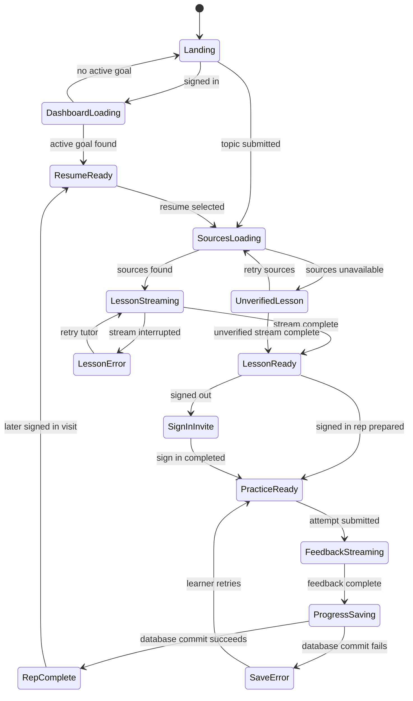

# Issue 4 Option B design and delivery contract

Status: Final implementation contract for Option B

Decision sources:

- [Issue 4](https://github.com/ChaiWithJai/llamatutor/issues/4)
- [ADR 0002](./adr/0002-option-b-netlify-identity-database.md)
- The Option B correction in issue 4
- The Netlify Identity and Database correction in issue 4

## Final direction

Dharmic Data Tutor uses Option B.

The public product remains a sourced explainer. A signed-in learner can add a
saved coaching loop around that lesson. The loop is:

1. Choose a topic and level.
2. Read a lesson that names its web sources.
3. Complete one practice rep.
4. Receive focused feedback.
5. Save one next rep.
6. Return later and resume.

There is no separate daily warmup screen. There are no reminders, grades,
social features, or mastery claims in this release.

Netlify Identity owns accounts. Netlify Database stores learner state in
Postgres. Signed-out learners can still use the public lesson.

## First learner and success behavior

The first learner is a self-directed person with a specific concept they want
to understand. The first domain is a general education topic that can be
explained from public web sources. The tutor is not designed to make medical,
legal, or financial decisions for the learner.

The useful behavior is a completed practice rep that is saved with feedback and
a next rep. The return behavior is a learner opening that saved next rep in a
later visit.

A streak increments when the server saves a completed practice rep. A second
completion on the same calendar day does not increment it again. A streak is
practice history. It is not a measure of knowledge.

## Jobs to be done

| ID | Learner need | Product response | Evidence |
| --- | --- | --- | --- |
| JTBD 1 | I want a clear explanation at my level. | The learner chooses a topic and one of six levels. | `components/InitialInputArea.tsx:22`, `app/page.tsx:286` |
| JTBD 2 | I want to inspect what informed the lesson. | The session shows named source links or an unverified warning. | `components/Sources.tsx:13`, `app/page.tsx:250` |
| JTBD 3 | I want to practice instead of only reading. | A signed-in learner gets one short practice rep beside the lesson. | `components/CoachPanel.tsx:84`, `app/page.tsx:132` |
| JTBD 4 | I want useful feedback and one clear next action. | The tutor returns focused feedback and the server saves a next rep. | `app/page.tsx:346`, `netlify/functions/coach.ts:292` |
| JTBD 5 | I want to continue on another visit or device. | The landing page shows the active goal, streak, and pending rep after sign-in. | `components/ResumeBanner.tsx:5`, `netlify/functions/coach.ts:154` |
| JTBD 6 | I want failures to be clear and recoverable. | Source and model failures keep the session usable and show retry controls. | `app/page.tsx:242`, `app/page.tsx:253` |
| JTBD 7 | I want to control my saved data. | The account dialog supports export and deletion. | `components/AccountDialog.tsx:32`, `netlify/functions/coach.ts:105` |
| JTBD 8 | I want to finish a session on a phone or with a keyboard. | The layout keeps the composer reachable and exposes mobile source overflow. | `app/globals.css:146`, `app/globals.css:973` |

## Screen and state map

### Landing while signed-out

The learner sees the topic field, level selector, suggestions, product proof,
and sign in action. Starting a lesson does not require an account.

### Landing while signed-in

The learner sees the same public entry point. If an active goal exists, the
resume banner shows:

- the topic
- the practice streak
- the pending next rep
- a resume action

### Learning session while signed-out

The learner sees the lesson, named sources, and follow up composer. The coaching
panel explains what sign in adds. The lesson remains usable without sign in.

### Learning session while signed-in

The learner sees one practice rep. The practice rep has one text field and one
save action. The learner can continue asking lesson questions before or after
the rep.

### Feedback and next rep

After a practice submission, the tutor shows feedback in the conversation. The
coaching panel then shows:

- rep completion
- the updated practice streak
- one saved next rep
- a plain statement that the streak does not mean mastery

This state replaces the older separate "Done for today" and wrapup screen. The
practice submission is the completion action in Option B.

### Account dialog

The learner can download all stored coaching data or delete it. Deletion keeps
the Identity account active and removes the learning records.

## Session state machine

The source failure path continues with an unverified lesson and leaves a retry
action visible. The page never presents an unverified lesson as sourced.

## Data and API contract

The browser does not send a learner ID. The coaching function reads the
authenticated Identity user and scopes every query to that ID.

| Method | Path | Result |
| --- | --- | --- |
| `GET` | `/api/coach` | Current profile, active goal, pending rep, recent reps, and session count |
| `GET` | `/api/coach?export=1` | Download of all stored learning data |
| `POST` | `/api/coach` | Start a goal, ensure a pending rep, or complete a rep |
| `DELETE` | `/api/coach` | Delete all learning data for the signed in user |

The database enforces one active goal per learner and one pending rep per goal.
Rep completion, session creation, next rep creation, and streak update happen
inside one transaction.

## Design system additions

The coaching layer uses `--color-accent-ritual`. This token separates practice
state from the green lesson state and orange source state.

The shared coaching components are:

- `ResumeBanner` for the active goal and return action
- `StreakBadge` for visible practice history
- `NextRepCard` for the saved next action
- `CoachPanel` for sign in, practice, feedback, and completion states

The existing accessibility contract applies to every state. Controls remain
keyboard reachable. Focus is visible. Loading regions expose their state.
Streaming text uses a live region. The reduced motion setting removes
nonessential animation.

## Analytics contract

The client sends `session_completed` only after the server commits a completed
rep. The event includes:

- the streak count
- whether the session had named sources

The event does not include the learner email, topic, attempt, feedback, or next
rep.

## Blackbox acceptance plan

| Given | When | Expected result |
| --- | --- | --- |
| Signed out learner | Starts a topic | A lesson streams and the coaching panel offers sign in |
| Source service failure | Starts a topic | The lesson is labeled unverified and source retry remains visible |
| Model interruption | A response has partly streamed | Existing text remains and tutor retry is visible |
| Long lesson | The response exceeds the viewport | The reply composer remains reachable |
| Mobile viewport | More than three sources exist | A visible edge treatment and horizontal scrolling show that more sources exist |
| Signed in learner with an active goal | Opens the landing page | The active topic, streak, pending rep, and resume action appear |
| Signed in learner | Completes a practice rep | Feedback, an updated streak, and one next rep appear |
| Same learner | Reloads after completion | The saved next rep appears in the resume banner |
| Same learner | Completes two reps on one day | The streak increments only once |
| Keyboard user | Runs the public lesson flow | Every action is reachable and focus remains visible |
| Reduced motion user | Uses an animated state | Nonessential animation is suppressed |
| Learner requests export | Uses the account dialog | A JSON file containing only that learner's data downloads |
| Learner confirms deletion | Uses the account dialog | Saved learning data is gone after reload |

## Implementation inventory

### Code

- `app/page.tsx`
- `components/AuthDialog.tsx`
- `components/AccountDialog.tsx`
- `components/CoachPanel.tsx`
- `components/NextRepCard.tsx`
- `components/ResumeBanner.tsx`
- `components/Sources.tsx`
- `components/StreakBadge.tsx`
- `netlify/functions/coach.ts`
- `utils/coaching.ts`

### Configuration and data

- `netlify.toml`
- `netlify/database/migrations/20260730042000_option_b_coaching.sql`
- `.github/workflows/ci.yml`
- Netlify Identity settings
- Netlify Database branches
- Netlify environment variables

### Runtime dependencies

- `@netlify/identity`
- `@netlify/database`
- `pg`
- `zod`
- `next-plausible`
- `exa-js`
- Together AI chat completions

## Investigation and reflection

### Occurrence A

Problem surface: The issue body still names Option C, a daily warmup, and local
browser persistence after owner decisions rejected all three.

Evidence anchors:

- Issue 4 section 0
- Issue 4 Option B correction
- Issue 4 persistence correction
- `docs/adr/0002-option-b-netlify-identity-database.md:19`

Code smell label: stale specification

Code Complete challenge class: managing changing requirements

Structural cause: The decision changed in comments, but no single replacement
contract was written.

### Occurrence B

Problem surface: The browser suite covered the public lesson and layout fixes,
but it did not cover the signed in practice and return loop that defines Option
B.

Evidence anchors:

- `tests/e2e/tutor.spec.ts:277`
- `components/CoachPanel.tsx:59`
- `components/ResumeBanner.tsx:27`
- `app/page.tsx:346`

Code smell label: critical path coverage gap

Code Complete challenge class: testing and quality assurance

Structural cause: The account and database path was tested manually in staging,
while CI kept only the older public lesson journeys.

### Cross pattern

Observed fact: Product decisions and runtime behavior moved faster than the
main design issue and automated browser coverage.

Inference: A design issue can look complete while its latest decisions live
only in comments and its main product loop depends on manual proof.

### RIOA reflection

- Reasoning: The team chose the smallest loop that can prove practice and
  return behavior.
- Interpreting: Option B means the practice rep is the ritual. It does not mean
  adding a separate warmup.
- Observing: The shipped code has the core loop, but the issue contract and CI
  evidence were incomplete.
- Acting: This document replaces the stale design contract, and the browser
  suite now covers the signed in loop.

### New principles

1. Rewrite the main contract when a decision comment changes its direction.
2. Add automated coverage for the behavior that gives an option its name.
3. Send completion analytics only after durable state commits.
4. Keep public learning usable when optional account or source services fail.

## Closure checklist

- [x] Option B is the only documented direction.
- [x] The separate warmup screen and state are removed.
- [x] The signed out lesson remains usable.
- [x] Netlify Identity and Database own saved learner state.
- [x] Goal, lesson, practice, feedback, next rep, and resume states exist.
- [x] Streak behavior records practice and avoids mastery claims.
- [x] Source and model failures are honest and recoverable.
- [x] Header, long session, and mobile source fixes are implemented.
- [x] Ritual, streak, next rep, and resume design elements are documented.
- [x] CI covers the public lesson and signed in coaching loop.
- [x] Database integration coverage runs inside a rolled back transaction.
- [x] Learners can export and delete their data.
- [x] Pull requests receive CI and Netlify previews.

Production release evidence belongs in issue 4 so this contract can remain
stable after later deployments.
